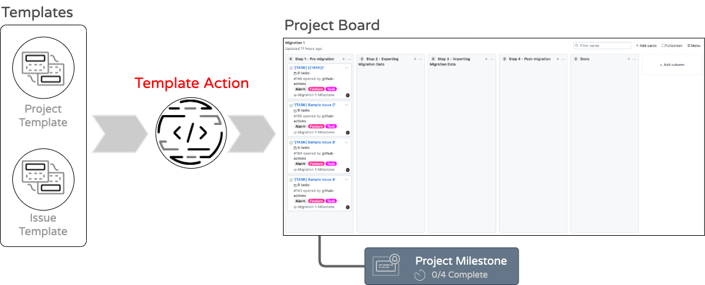
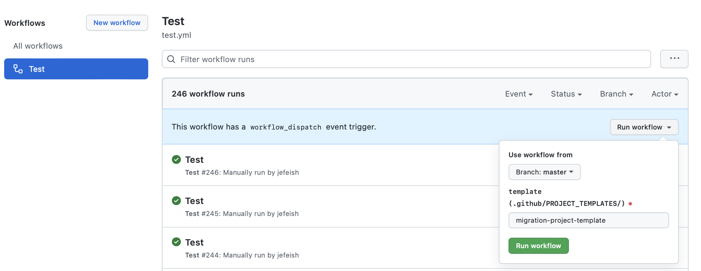

# project-template-action

GitHub action to create Project Boards from template Yaml files.

This **Action** creates a **Project Board with pre-populated Issues**, based on **Issue-Templates**.

---

## Overview 



---

## Action Workflow Example

Location: `.github/workflows/test.yml`

```Yaml
name: Test

on:
  workflow_dispatch:
    inputs:
      template:
        type: string
        description: template (.github/PROJECT_TEMPLATES/)
        required: true

jobs:
  test:
    runs-on: ubuntu-latest
    steps:
      - uses: actions/checkout@v2
      - run: npm install @octokit/action
      - uses: ./
        with:
          GITHUB_TOKEN: ${{ secrets.GITHUB_TOKEN }}
          templateName: ${{ github.event.inputs.template }}

```

---

## Project Template Sample

Location: `.github/PROJECT_TEMPLATE/migration-project-template.yml`

```Yaml
---
projects:
  - name: Migration 1
    description: Migration Project 1 
    # Milestone due date - example format '2022-11-10T00:00:00Z'
    duedate: '2022-11-10T00:00:00Z'
    columns:

      - name: Step 1 - Pre-migration
        manage: none
        cards:
          - name: Issue_prepare-migration-checklist
            type: Issue
            template: Issue_prepare-migration-checklist
            parameters:
              ASSIGNEES: jefeish
              TITLE: Migration 1
              TASK: Sample Issue A
          - name: Issue_consolidate-migration-resources
            type: Issue
            template: Issue_consolidate-migration-resources
            parameters:
              ASSIGNEES: jefeish
              TITLE: Migration 1
              TASK: Sample Issue B
          - name: Issue_cleanup-resources
            type: Issue
            template: Issue_cleanup-resources
            parameters:
              ASSIGNEES: jdoe
              TITLE: Migration 1
              TASK: Sample Issue C
          - name: Issue_determine-scope-of-migration
            type: Issue
            template: Issue_determine-scope-of-migration
            parameters:
              ASSIGNEES: jdoe
              TITLE: Migration 1      
              TASK: Sample Issue D

      - name: Step 2 - Exporting Migration Data
        manage: none

      - name: Step 3 - Importing Migration Data
        manage: none

      - name: Step 4 - Post-migration
        manage: none

      - name: Done
        manage: none
```

## To Run the Test Action



## Concept Details

### TL;DR

#### The goal of this action is to **`build a project board`** and `Cards` from scratch, using a template Yaml file!

This action strictly uses templates to create all of it's components. Project board `Issues` as well as `Cards`, must be based on a `.github/ISSUE_TEMPLATE`.

 :thinking: Why? ...This ensures a standardized process that provides consitency and reusablilty.

However, this approach requires that we have an `Issue Template` for every project card we create.
To be precise, you cannot provide project card  content information in the project template Yaml file, only references to `Issue Templates`.

> NOTE: Project Cards are created based on Issue Templates, the content only, not the Header information (assignees, label, etc.)
